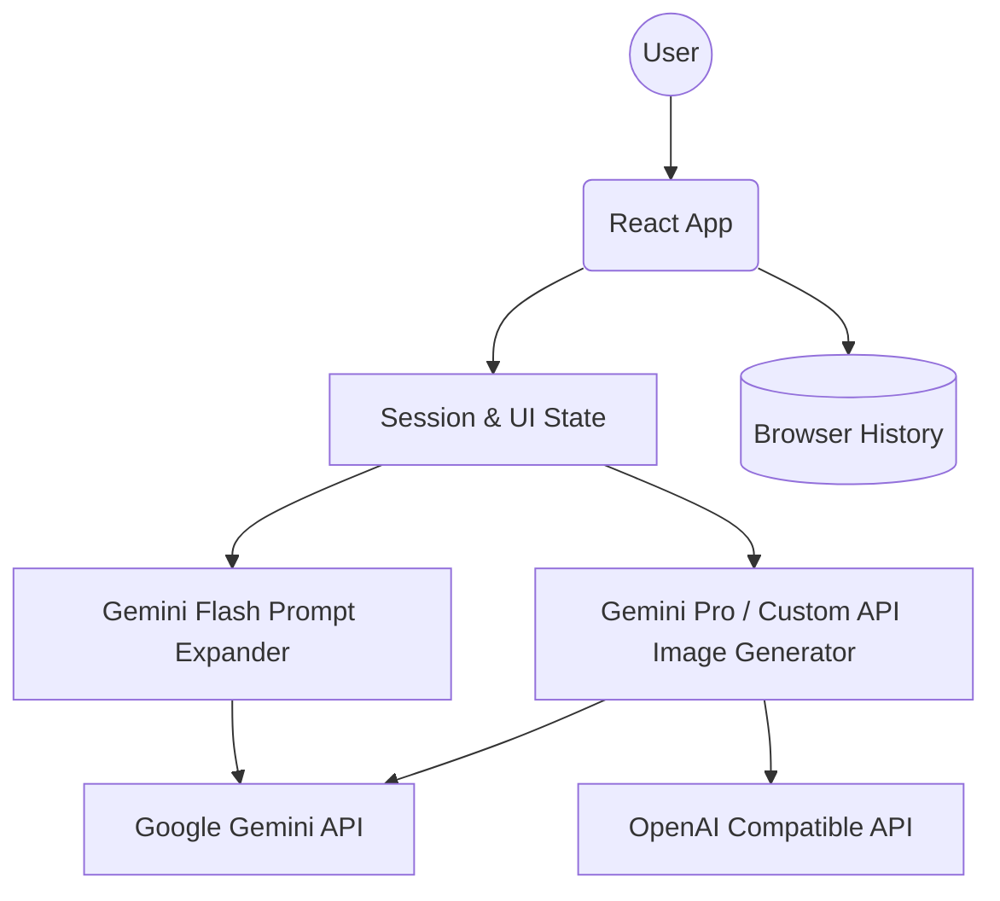

# System Architecture Design - SynthVision Data Forge

## 1. System Overview
SynthVision Data Forge is a client-heavy web application built on **React 18** and **Vite**. It operates as a bridge between user-defined CV requirements and Cloud-based Visual Foundation Models. The architecture follows a modular pattern separating UI components, state management (Sessions), and external service integration.

## 2. High-Level Architecture

## 3. Component Architecture
*   **App.tsx (Orchestrator):** Manages the global state, including session history, active generation tasks, and modal visibility.
*   **Sidebar.tsx (Navigator):** Handles navigation between past sessions and displays configuration deep-dives.
*   **Service Layer (api.ts):** Encapsulates the logic for interacting with Google GenAI and custom endpoints, including prompt extraction and base64 handling.

## 4. Key Logic Flows

### 4.1. The "Data Forge" Pipeline
1.  **Input Phase:** User provides a Base Prompt and Reference Images.
2.  **Expansion Phase:** The `generateDiversePrompts` service calls **Gemini Flash** with a specialized system instruction to create $N$ variations focusing on "Domain Randomization" (Lighting, Weather, Environment).
3.  **Generation Phase:** The `generateImageWithGemini` (or custom) service is called iteratively. For each variation, it sends the specific expanded prompt + original reference images.
4.  **Feedback Phase:** Images are streamed into the UI as they arrive, and session logs are updated per step.

### 4.2. State Management Strategy
The application uses a "Source of Truth" ref (`sessionsRef`) paired with React state to handle asynchronous updates across multiple generator calls. This prevents stale state issues during long-running batch operations.

## 5. Technological Stack
*   **Frontend Framework:** React 19 + TypeScript
*   **Build Tool:** Vite
*   **Styling:** Tailwind CSS (Modern configuration with CSS variables)
*   **State Persistence:** Local state (In-memory) with placeholder for potential IndexedDB/LocalStorage persistence.
*   **AI Integration:** `@google/genai` SDK for low-latency communication with Gemini models.

## 6. Design Patterns
*   **Strategy Pattern:** Used in the generation logic to switch between Gemini and OpenAI-compatible models seamlessly.
*   **Observer Pattern:** Generation progress and logs are pushed to the session state, which UI components observe.
*   **Ref-State Sync:** Ensuring async closures always have access to the latest application state.
